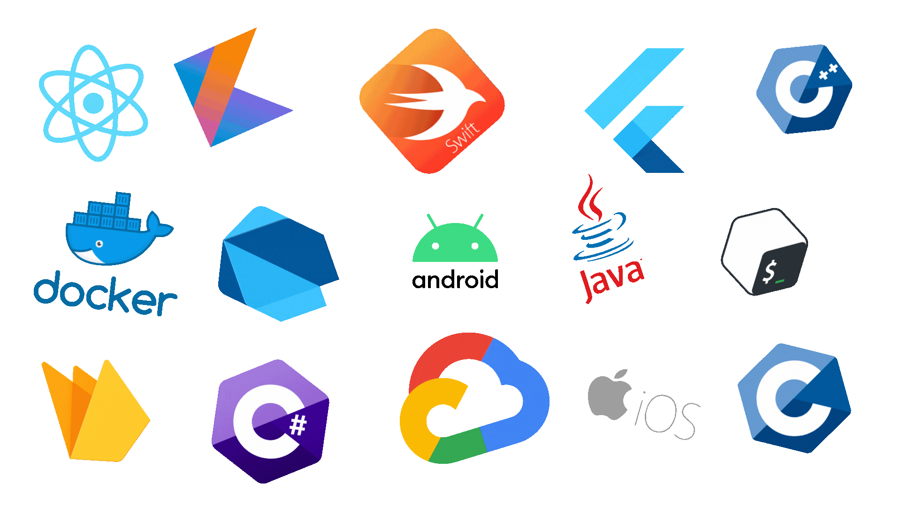

# 👋 - ¡Bienvenido!

Soy desarrollador mobile especializado en la creación de aplicaciones nativas y multiplataforma para Android e iOS. Mi enfoque combina diseño intuitivo, rendimiento optimizado y una experiencia de usuario fluida. A lo largo de mi trayectoria, he trabajado en proyectos que van desde startups hasta soluciones empresariales, siempre con el objetivo de transformar ideas en productos digitales funcionales y escalables.

---

## 🛠 Tecnologías y herramientas

---

## 📈 Estadísticas de GitHub

  
  

---

## 🧠 Sobre mí

- 🎓 Graduado en Desarrollo de Aplicaciones Multiplataforma por el IES Oretania  
- 📱 Especializado en Kotlin y Java para Android  
- 🚀 Me encanta aprender nuevas tecnologías y superar retos técnicos  
- 🤝 Abierto a colaboraciones, mentorías y proyectos creativos  

---

## 📬 Conectemos

¿Tienes una idea, un reto o simplemente quieres charlar sobre tecnología? ¡Hablemos!

- 🌐 Web: [jabedmar.com](https://jabedmar.com)  
- 📧 Email: [jantonio.developer@gmail.com](mailto:jantonio.developer@gmail.com)  
- 💼 LinkedIn: [Juan Antonio Bedmar González](https://www.linkedin.com/in/juan-antonio-bedmar-gonz%C3%A1lez-79202127b/)  

---

  Hecho con ❤️ por Juan Antonio  

